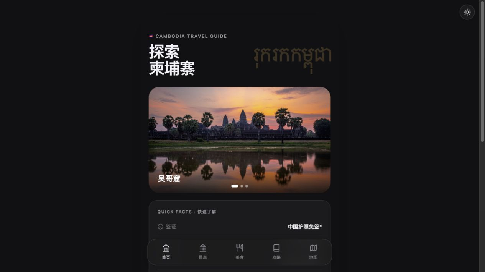
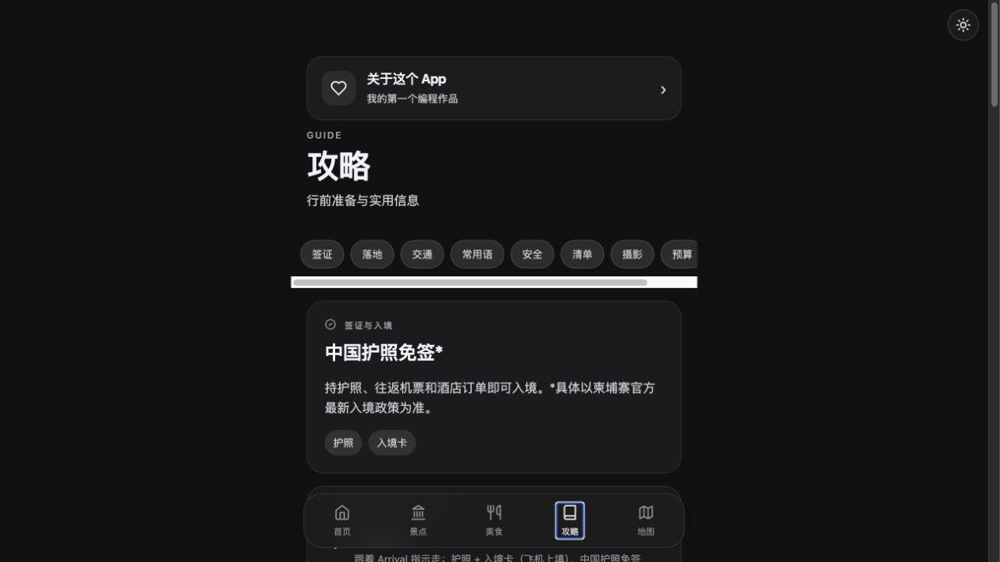
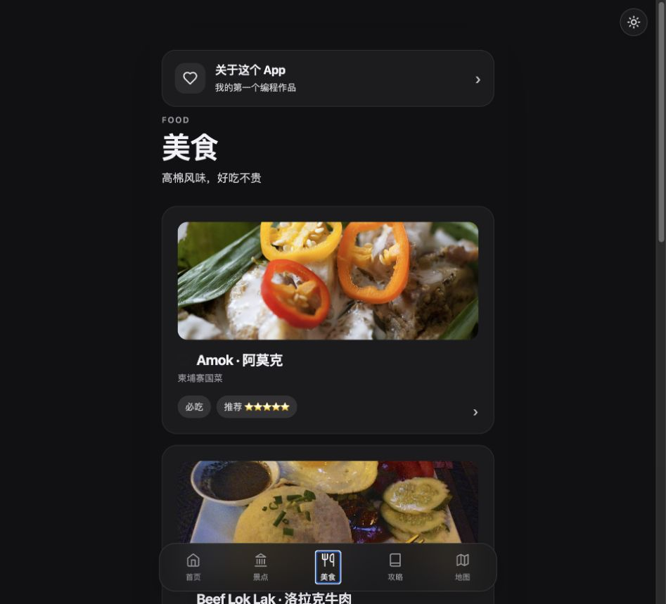
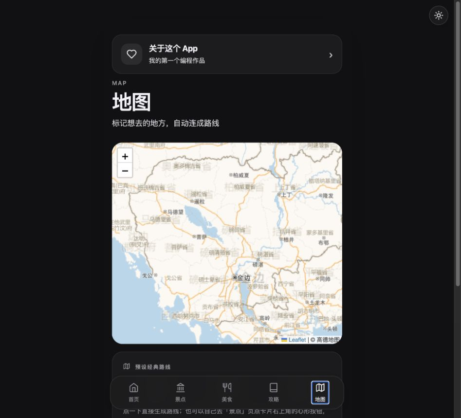
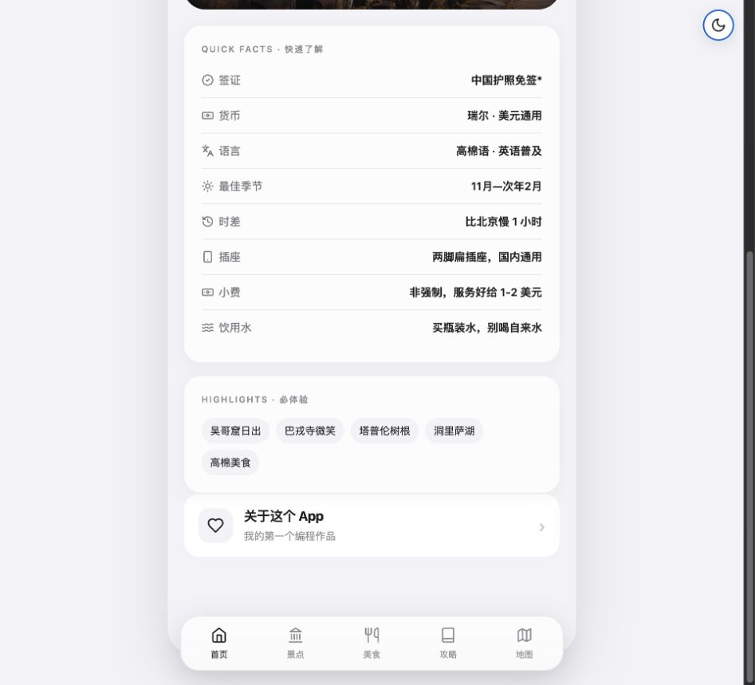

# 🇰🇭 柬埔寨旅行指南 · Cambodia Travel Guide

> Hola！
>我是一名对编程与计算机零基础的社科学生、人类学爱好者、兼职「地球街溜子」的 Cadence Lu，这是我做的第一个 vibe coding 作品。
> 从一次柬埔寨旅行计划出发，把一份 Markdown 攻略，一步步变成了一款能看、能玩、能规划路线的旅行指南 App——也是我学习AI编程的第一块里程碑。
> 我对人类学与「文化与艺术产业创业」方向的兴趣，让我更关心一件事：**一个普通人如何与陌生的地方相遇**。这个 App 是工具，也是我观察世界的方式。

🔗 **在线体验**：https://cadencelu-max.github.io/Cambodia-travel-app/

---

## 📸 预览

| 首页 | 攻略 | 美食 |
|---|---|---|
|  |  |  |

| 地图路线 | 深色模式 |
|---|---|
|  |  |

---

## ✨ 功能

- **🏛️ 景点**：多层导航（暹粒 → 城市/吴哥窟 → 小圈·大圈·外圈），18+ 个景点带图片和历史介绍
- **🍜 美食**：每道菜配照片和「口感 / 做法 / 价格」详情
- **📋 攻略**：签证、落地流程、交通、常用语速查、行前清单（可勾选自动保存）、安全贴士
- **🗺️ 地图**：小圈/大圈/外圈预设路线 + 自己点红心 DIY 路线；路线可增删；全程导航支持 **Google Maps / 高德地图** 双选择
- **💰 预算计算器**：输入各项花费，实时合计，自动保存
- **🌙 深色模式**：右上角一键切换，自动记住偏好

## 🛠️ 技术

- 纯 **HTML / CSS / JavaScript**，无框架、无构建步骤
- **Leaflet** 地图（本地加载）+ 高德地图瓦片（国内可稳定访问）
- **GitHub Pages** 免费部署
- 所有数据都存在浏览器本地（localStorage），无需服务器

## 🚀 本地运行

直接双击 `index.html`，或用 VS Code 的 Live Server 打开。

## 🗺️ 路线图

- [x] 上线 GitHub Pages
- [x] 深色模式 / 预算计算器 / 地图导航双选择
- [x] 离线模式（PWA：无网也能看）
- [ ] 「我的旅行」页面：旅行后加入自己的照片与手记

## 📮 联系

- 邮箱：luqiutong.skywalker@gmail.com
- GitHub：[cadencelu-max/Cambodia-travel-app](https://github.com/cadencelu-max/Cambodia-travel-app)

---

*Made by Cadence Lu · 我的第一个编程作品*
